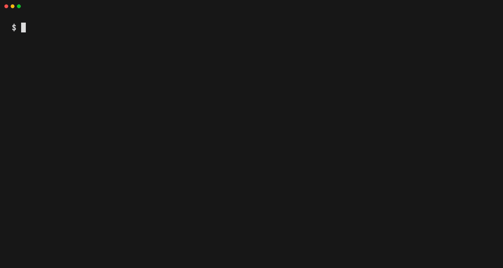

<p align="center">
  <b>English</b> | <a href="README_pt-br.md">Português</a>
</p>

<p align="center">
  
</p>

<p align="center">
  <a href="https://github.com/alvarorichard/GoAnime/actions/workflows/ci.yml"></a>
  <a href="https://github.com/alvarorichard/GoAnime/releases/latest"></a>
  <a href="https://aur.archlinux.org/packages/goanime"></a>
  <a href="LICENSE"></a>
</p>

GoAnime is a terminal application for searching, streaming and downloading
anime, movies and TV shows in English and Brazilian Portuguese. It searches
several sources at once, plays the selected episode in
[mpv](https://mpv.io/), and keeps track of where you stopped.

<p align="center">
  
</p>

It is a single binary for Linux, macOS and Windows, and needs nothing but mpv
to run.

## Contents

- [Features](#features)
- [Installation](#installation)
- [Usage](#usage)
- [Sources](#sources)
- [Configuration](#configuration)
- [Troubleshooting](#troubleshooting)
- [Using GoAnime as a library](#using-goanime-as-a-library)
- [Contributing](#contributing)
- [Community](#community)
- [Disclaimer](#disclaimer)
- [License](#license)

## Features

- Searches every enabled source in parallel and falls back to another source
  when one fails.
- Subbed and dubbed anime in English and Portuguese, plus Portuguese movies
  and TV shows.
- Streams with quality selection, or downloads a single episode, a range, or
  a whole series.
- Saves downloads with Plex-compatible names (`Anime - S01E01.mp4`).
- Resumes playback and remembers watched episodes.
- Skips openings and endings automatically.
- Discord Rich Presence.
- Anime4K upscaling for downloaded videos and images.
- Updates itself with `goanime --update`.

## Installation

GoAnime uses [mpv](https://mpv.io/) for playback. Install mpv first, unless
you use the Windows installer, which includes it.

Prebuilt binaries for every platform are available on the
[releases page](https://github.com/alvarorichard/GoAnime/releases/latest).

### Windows

Download and run `GoAnime-Installer-<version>.exe` from the
[latest release](https://github.com/alvarorichard/GoAnime/releases/latest).
It installs GoAnime and mpv and adds both to your `PATH`.

If you prefer not to use the installer, download
`goanime-windows-amd64.zip`, extract it, and put `goanime.exe` and `mpv.exe`
somewhere on your `PATH`.

### macOS

```bash
brew install mpv
curl -Lo goanime https://github.com/alvarorichard/GoAnime/releases/latest/download/goanime-darwin-universal
chmod +x goanime
sudo mv goanime /usr/local/bin/
sudo xattr -d com.apple.quarantine /usr/local/bin/goanime
```

The binary is universal and runs on both Apple Silicon and Intel Macs.

### Arch Linux

GoAnime is available in the [AUR](https://aur.archlinux.org/packages/goanime):

```bash
yay -S goanime
```

### Debian, Ubuntu, Fedora and other distributions

Install mpv with your package manager (`sudo apt install mpv` or
`sudo dnf install mpv`), then:

```bash
curl -LO https://github.com/alvarorichard/GoAnime/releases/latest/download/goanime-linux-amd64.tar.gz
tar -xzf goanime-linux-amd64.tar.gz
sudo install goanime-linux-amd64 /usr/local/bin/goanime
```

For ARM64, replace `amd64` with `arm64`.

### From source

With Go 1.27 or later:

```bash
go install github.com/alvarorichard/Goanime/cmd/goanime@latest
```

Progress tracking is backed by SQLite and requires CGO, so a C compiler must
be available when building. Without one, GoAnime still builds and runs, but
does not track progress. The release binaries are built with SQLite. See
[docs/BUILD_OPTIONS.md](docs/BUILD_OPTIONS.md) for details.

## Usage

Run `goanime` without arguments to start the interactive search. Type a name,
choose a result with the arrow keys, pick an episode, and it opens in mpv.
You can also pass the name directly:

```bash
goanime "one piece"
```

Use spaces in the name, not hyphens.

Downloads go to `~/.local/goanime/downloads/anime/` unless you pass `-o`:

```bash
goanime -d "one piece" 1                  # episode 1
goanime -d -r "naruto" 1-12               # episodes 1 to 12
goanime -d -a "one piece"                 # every episode
goanime -d --quality 720p "frieren" 1     # a specific quality
goanime -d -o ~/Anime "bleach" 10         # a custom directory
```

Movies and TV shows use `-dm`:

```bash
goanime -dm "Interstellar"                # a movie
goanime -dm -r "Dark" 1 1-5               # season 1, episodes 1 to 5
goanime -dm -a "Dark"                     # every season
```

Other options:

```bash
goanime --source animefire "jujutsu kaisen"   # search a single source
goanime --upscale --upscale-hq video.mp4      # upscale a file with Anime4K
goanime --update                              # update to the latest release
goanime --debug "naruto"                      # write a debug log
```

Run `goanime -h` for the full list of options.

## Sources

| Source    | Content    | Language                   | Notes                                         |
| --------- | ---------- | -------------------------- | --------------------------------------------- |
| HiAnime   | Anime      | English, subbed and dubbed | Subbed by default                             |
| AnimeFire | Anime      | Portuguese (Brazil)        |                                               |
| Goyabu    | Anime      | Portuguese (Brazil)        | Disabled by default, see below                |
| StartFlix | Movies, TV | Portuguese (Brazil)        | Dubbed and subtitled                          |
| TopCine   | Movies, TV | Portuguese (Brazil)        | Catalog only; playback goes through StartFlix |

Goyabu is behind a Cloudflare challenge and is disabled by default. Enable it
with `GOANIME_ENABLED_SOURCES=goyabu`.

GoAnime depends on third-party websites, and those websites change without
notice. When one does, the corresponding source can stop working until it is
updated. A [scheduled workflow](.github/workflows/source-health.yml) checks
every source daily, so breakage is usually visible there before it is
reported.

## Configuration

GoAnime needs no configuration file. A few environment variables cover less
common needs:

| Variable                         | Description                                                       |
| -------------------------------- | ----------------------------------------------------------------- |
| `GOANIME_ENABLED_SOURCES`        | Comma-separated sources to enable, such as `goyabu`               |
| `GOANIME_DISABLED_SOURCES`       | Comma-separated sources to skip                                   |
| `GOANIME_HIANIME_AUDIO`          | `sub` (default) or `dub`                                          |
| `GOANIME_STRICT_SOURCE`          | Set to `1` to report an error instead of guessing an unknown source |
| `SSL_CERT_FILE`, `SSL_CERT_DIR`  | Use a custom CA bundle, see [Troubleshooting](#troubleshooting)   |

## Troubleshooting

### Reporting a problem

Run the same command again with `--debug`. GoAnime prints the path of a log
file when it starts. Attach that file to your
[issue](https://github.com/alvarorichard/GoAnime/issues/new) along with the
command you ran and your operating system.

### mpv is not found

Make sure `mpv --version` works in the same terminal you run GoAnime from.
On Windows, open a new terminal after installing so the updated `PATH` is
picked up.

### TLS errors behind a corporate proxy or custom CA

If every request fails with a certificate error, typically on a network that
inspects TLS with its own root CA, point GoAnime at that CA bundle:

```bash
export SSL_CERT_FILE=/path/to/corporate-ca.pem   # a single PEM bundle
export SSL_CERT_DIR=/path/to/ca-certificates.d   # or a directory of PEMs
```

Since Go 1.27 these variables are honoured on Windows and macOS as well, not
just Linux: when either is set, GoAnime verifies certificates with Go's own
verifier against your bundle instead of the platform certificate store. To go
back to the platform store without unsetting the variables, run with
`GODEBUG=x509sslcertoverrideplatform=0`.

## Using GoAnime as a library

The search and scraping code is exposed as a public Go package:

```go
client := goanime.NewClient()
results, err := client.SearchAnime("One Piece", nil)
```

See [pkg/goanime](pkg/goanime) for the API and
[pkg/goanime/examples](pkg/goanime/examples) for complete programs.

## Contributing

Bug reports, fixes and new sources are welcome.

Most of the maintenance work in GoAnime is keeping sources working as the
sites behind them change, and that is also the easiest way to start
contributing: the [source health workflow](https://github.com/alvarorichard/GoAnime/actions/workflows/source-health.yml)
shows which sources are failing, and each source is a self-contained package
under `internal/scraper/providers`. To add a new one, follow
[docs/ADDING_A_SOURCE.md](docs/ADDING_A_SOURCE.md), which uses Goyabu as the
reference implementation.

To build and test:

```bash
git clone https://github.com/alvarorichard/GoAnime.git
cd GoAnime
git checkout dev
go build ./cmd/goanime
go test -short ./...
```

Development happens on the `dev` branch. Create your branch from `dev` and
open pull requests against `dev`; `main` only receives releases. Code style,
linters and the rest of the workflow are described in
[docs/Development.md](docs/Development.md).

## Community

- [Discord](https://discord.gg/FbQuf78D9G) for questions, feedback and release
  announcements.
- [GoAnime Mobile](https://github.com/alvarorichard/goanime-mobile), the
  Android version.
- [goanime.online](https://goanime.online/)

## Disclaimer

GoAnime does not host, upload or distribute any media. It retrieves content
that third-party websites make publicly available and is not affiliated with
any of them. Users are responsible for complying with the laws of their
country.

## License

GoAnime is released under the [MIT License](LICENSE).
